# Lattice — How It Works (Diagrams)

Visual reference for Lattice's architecture, workflows, and data flows.
All diagrams use Mermaid syntax. View in any Mermaid-compatible renderer
(GitHub, VS Code Markdown Preview with Mermaid plugin, etc.).

---

## 1. The Three-Tier Architecture

Lattice is built on three tiers that stack on each other. Refiners are
optional — atoms work out of the box with built-in defaults.

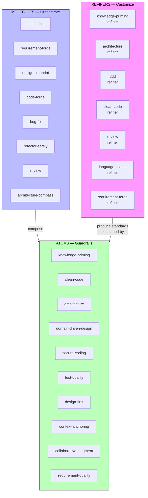

### What Each Tier Does

| Tier | Count | Role | Invoked By |
|------|-------|------|------------|
| Atoms | 10 | Enforce a single engineering principle via checklists + anti-pattern scans | Molecules auto-activate them; users can invoke standalone |
| Molecules | 8 | Multi-step workflows that compose atoms at the right stages | User types command in AI chat (e.g. `/code-forge`) |
| Refiners | 7 | Guided interviews producing project-specific standards docs | User runs once during setup or when standards evolve |

---

## 2. The Full Pipeline — Feature Lifecycle

The primary delivery path flows left to right. Each stage consumes artifacts
from the previous stage and produces artifacts for the next, all stored in
the `.lattice/` living context layer.

```mermaid
flowchart LR
    INIT["/lattice-init<br>──────────<br>Scan project<br>Suggest refiners<br>Create config.yaml"]

    INIT -->|"setup done"| REQ

    REQ["/requirement-forge<br>──────────<br>Intake &amp; intake<br>Epic definition<br>Feature discovery<br>Feature specs"]

    REQ -->|".lattice/requirements/"| DES

    DES["/design-blueprint<br>──────────<br>L1 Capabilities<br>L2 Components<br>L3 Interactions<br>L4 Contracts"]

    DES -->|".lattice/context/"| CODE

    CODE["/code-forge<br>──────────<br>Load blueprint<br>Inside-out impl<br>Post-gen verification<br>Cross-component check"]

    CODE -->|"code + tests"| REV

    REV["/review<br>──────────<br>Identify delta<br>Classify &amp; load atoms<br>Targeted validation<br>Severity-ordered report"]

    REV -->|"insights to<br>.lattice/learnings/"| CODE2["next cycle<br>smarter"]

    style INIT fill:#ffd700,stroke:#333,color:#000
    style REQ fill:#87ceeb,stroke:#333,color:#000
    style DES fill:#98fb98,stroke:#333,color:#000
    style CODE fill:#ffa07a,stroke:#333,color:#000
    style REV fill:#dda0dd,stroke:#333,color:#000
    style CODE2 fill:#ffa07a,stroke:#333,color:#000,stroke-dasharray: 5 5
```

### Alternative Entry Paths

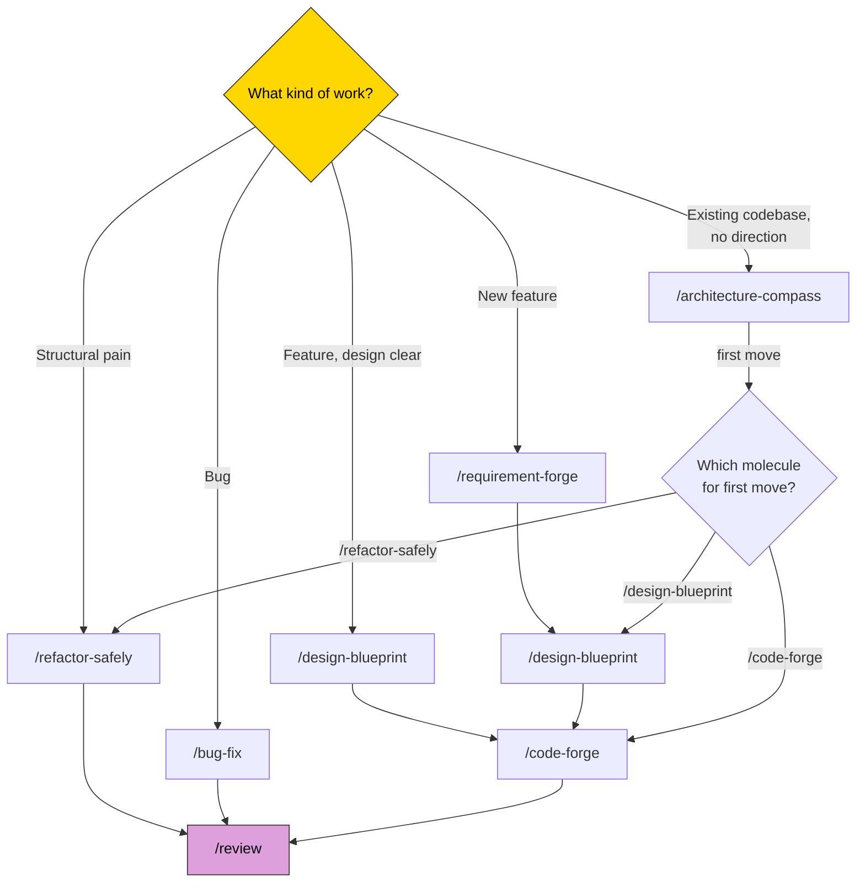

---

## 3. Molecule Composition Map

Every molecule composes specific atoms. Some atoms are "always on" for that
molecule; others are conditional (loaded only when the code touches that
concern).

```mermaid
flowchart TB
    subgraph mol ["MOLECULES"]
        LI["lattice-init"]
        RF2["requirement-forge"]
        DB["design-blueprint"]
        CF["code-forge"]
        BF["bug-fix"]
        RS["refactor-safely"]
        RV["review"]
        AC["architecture-compass"]
    end

    subgraph at ["ATOMS"]
        KP["knowledge-priming"]
        CC["clean-code"]
        AX["architecture"]
        DD["domain-driven-design"]
        SC["secure-coding"]
        TQ["test-quality"]
        DF["design-first"]
        CA["context-anchoring"]
        CJ["collaborative-judgment"]
        RQ["requirement-quality"]
    end

    %% lattice-init
    LI --> KP

    %% requirement-forge
    RF2 --> RQ
    RF2 -.->|"conditional"| KP
    RF2 --> CJ

    %% design-blueprint
    DB --> KP
    DB --> CA
    DB --> CJ
    DB --> DF
    DB --> AX
    DB --> DD

    %% code-forge
    CF --> KP
    CF --> CA
    CF --> CJ
    CF --> AX
    CF --> CC
    CF -.->|"domain layer only"| DD
    CF -.->|"trust boundaries only"| SC
    CF -.->|"when writing tests"| TQ

    %% bug-fix
    BF --> KP
    BF --> CA
    BF --> CJ
    BF --> CC
    BF --> TQ
    BF -.->|"conditional"| AX
    BF -.->|"conditional"| DD
    BF -.->|"conditional"| SC

    %% refactor-safely
    RS --> KP
    RS --> CA
    RS --> CJ
    RS --> CC
    RS --> TQ
    RS -.->|"conditional"| DF
    RS -.->|"conditional"| AX
    RS -.->|"conditional"| DD
    RS -.->|"conditional"| SC

    %% review
    RV --> KP
    RV --> CJ
    RV --> CC
    RV -.->|"conditional"| AX
    RV -.->|"conditional"| DD
    RV -.->|"conditional"| SC
    RV -.->|"conditional"| TQ

    %% architecture-compass
    AC --> KP
    AC --> AX
    AC -.->|"strategic only"| DD
    AC --> CJ

    linkStyle 0,1,2,3,4,5,6,7,8,9,10,11,12,13,14,15,16,17,18,19,20,21,22,23,24,25,26,27,28,29,30,31,32,33,34,35 stroke:#666,stroke-width:2px
    linkStyle 1,3,7,8,9,17,18,19,20,21,22,23,24,25,26,27,28,29,30,31,32,33,34,35 stroke:#999,stroke-width:1px,stroke-dasharray: 4 4
```

**Solid arrows** = always composed. **Dashed arrows** = conditional (loaded only when the work touches that concern).

---

## 4. Atom Config Resolution

When an atom activates, it resolves its rules through a layered lookup.
The resolution order is: defaults -> language idioms -> custom overlay.

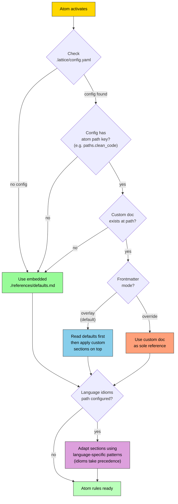

### Resolution Order Visualized

```
+---------------------------------------------------+
|  Layer 3: Custom overlay   (highest precedence)   |  <- .lattice/standards/clean-code.md (changed sections only)
+---------------------------------------------------+
|  Layer 2: Language idioms  (adapt per language)    |  <- .lattice/standards/language-idioms.md (if present)
+---------------------------------------------------+
|  Layer 1: Embedded defaults (base rules)           |  <- ./references/defaults.md (ships with Lattice)
+---------------------------------------------------+
```

---

## 5. The `.lattice/` Living Context Layer

The `.lattice/` folder is the project's AI memory. It grows with every
feature cycle — each pipeline stage reads from and writes to it.

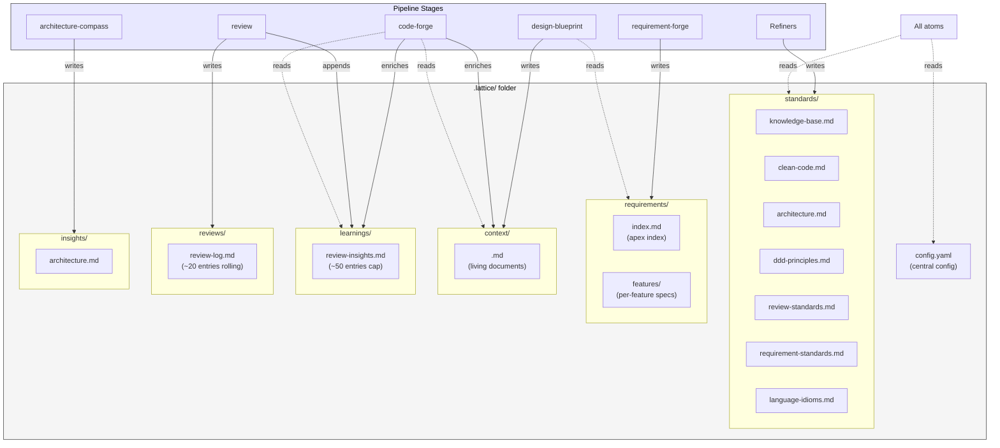

### Subfolder Lifecycles

| Folder | Written By | Read By | Lifecycle |
|--------|-----------|---------|-----------|
| `standards/` | Refiners | All atoms via config resolution | Stable — set once, rarely changes |
| `requirements/` | requirement-forge | design-blueprint | Per cycle — created with features, updated as specs evolve |
| `context/` | design-blueprint, code-forge, refactor-safely, bug-fix | code-forge, refactor-safely, bug-fix, review | Per feature — created on start, enriched during work |
| `learnings/` | review | code-forge, refactor-safely, bug-fix (at session start) | Append-only, pruned at ~50 entries |
| `reviews/` | review | Project health visibility | Rolling window, ~20 entries |
| `insights/` | architecture-compass | architecture-compass (resume) | One per project, updated as direction evolves |

---

## 6. Two-Pass Generation Model

Lattice uses a generate-then-verify approach rather than trying to generate
and validate simultaneously. This is more reliable — the AI reviews its own
output against atom checklists before presenting it.

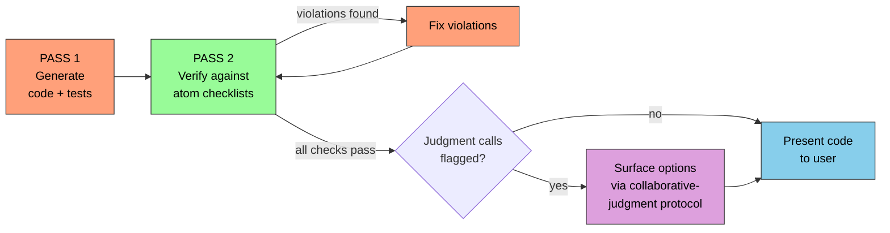

### Verification Tools Per Atom

Each atom provides two verification instruments used during Pass 2:

```
+-----------------------------------+  +-----------------------------------+
| Self-Validation Checklist         |  | Active Anti-Pattern Scan          |
| (numbered, imperative STOP lang)  |  | (checkbox format, scan for smells)|
|                                   |  |                                   |
| 1. SINGLE RESPONSIBILITY: ...     |  | [ ] God Function: ...             |
| 2. SIZE: ...                      |  | [ ] Deep Nesting: ...             |
| 3. COMPLEXITY: ...                |  | [ ] Cryptic Naming: ...           |
| 4. ABSTRACTION LEVEL: ...        |  | [ ] Long Parameter Lists: ...     |
| 5. NAMING: ...                    |  | [ ] Premature Abstraction: ...    |
| ...                               |  | ...                               |
+-----------------------------------+  +-----------------------------------+
         Hard rules                        Smell-level issues
```

---

## 7. Code-Forge — Inside-Out Build Order

code-forge builds from the inside out so that each layer's dependencies
already exist when it is built. Atoms are applied conditionally based on
which layer and which concerns are active.

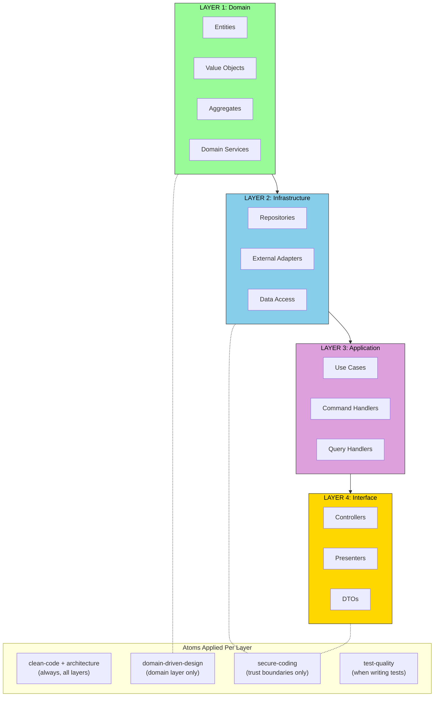

### Per-Component Workflow

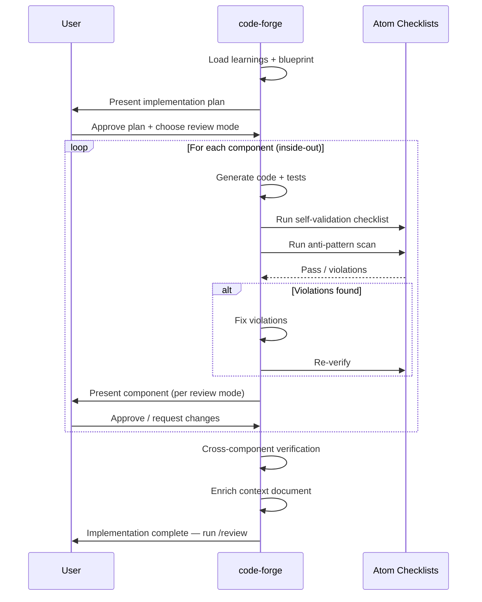

---

## 8. Review — Delta-Scoped Flow

The review molecule scopes its work to only what changed, loads only the
relevant atoms, and captures insights for future cycles.

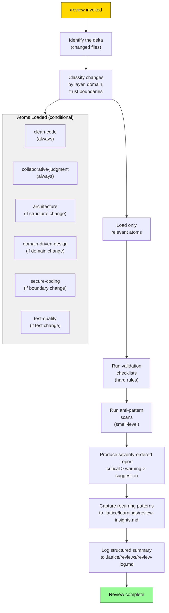

---

## 9. The Feedback Loop — How Lattice Gets Smarter Over Time

The key insight: the base framework (atoms, molecules, refiners) never
changes, but the living context layer makes it increasingly effective.

```mermaid
flowchart LR
    subgraph cycle1 ["Cycle 1"]
        C1_CODE["code-forge<br>generates code"]
        C1_REV["review<br>catches issues"]
        C1_INSIGHT["insights written<br>to .lattice/learnings/"]
        C1_CODE --> C1_REV --> C1_INSIGHT
    end

    subgraph cycle2 ["Cycle 2"]
        C2_LOAD["code-forge<br>loads past insights"]
        C2_CODE["generates code<br>(avoids past mistakes)"]
        C2_REV["review<br>catches NEW issues"]
        C2_INSIGHT["insights appended<br>(accumulating)"]
        C2_LOAD --> C2_CODE --> C2_REV --> C2_INSIGHT
    end

    subgraph cycle3 ["Cycle 3"]
        C3_LOAD["code-forge<br>loads richer insights"]
        C3_CODE["generates code<br>(avoids ALL past mistakes)"]
        C3_REV["review scope narrows<br>(fewer recurring issues)"]
        C3_LOAD --> C3_CODE --> C3_REV
    end

    C1_INSIGHT -->|"feeds"| C2_LOAD
    C2_INSIGHT -->|"feeds"| C3_LOAD

    style cycle1 fill:#fff3e0,stroke:#333,color:#000
    style cycle2 fill:#e8f5e9,stroke:#333,color:#000
    style cycle3 fill:#e3f2fd,stroke:#333,color:#000
```

### Context Document Lifecycle

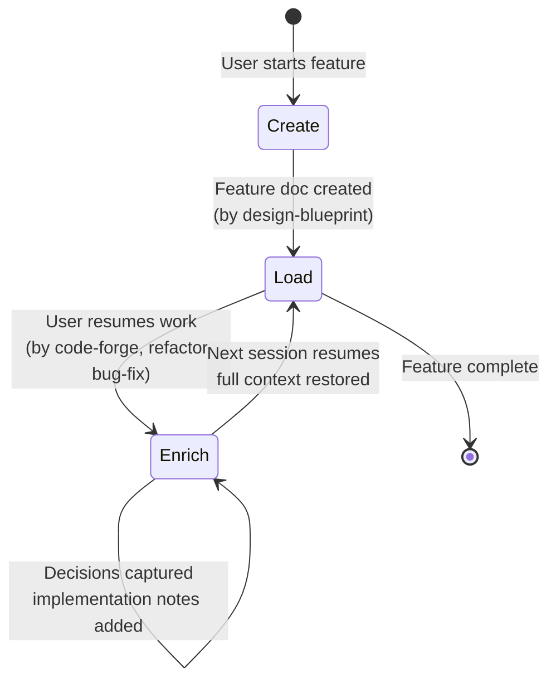

---

## 10. End-to-End Data Flow Summary

A single view showing all artifacts flowing through the pipeline:

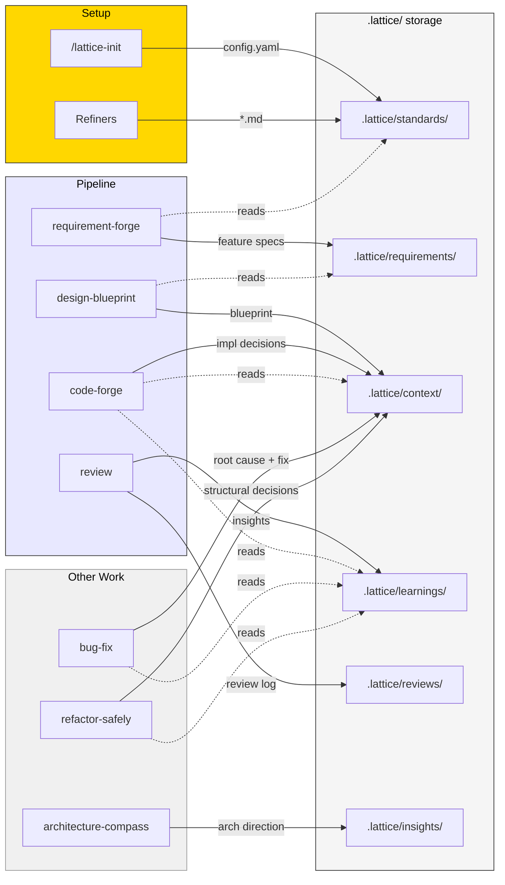
