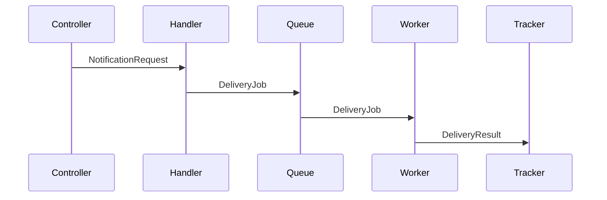

# Design-First Methodology Detail

Expanded reference for the 5-level progressive design methodology. Use this for notation guidance, interface patterns, and to understand what good vs poor output looks like at each level.

## Good vs Poor Output by Level

### Level 1: Capabilities

**Good** -- scoped, user-facing, no implementation detail:
1. Users receive email notifications when their order ships
2. Users can view notification history in their account
3. Failed deliveries are retried automatically

**Poor** -- leaks implementation detail or scope creeps:
1. A NotificationService class sends emails via SendGrid
2. A Redis-backed queue handles retry with exponential backoff
3. Users can configure notification preferences (SMS, email, push)
4. Analytics dashboard tracks delivery rates

The poor version names technologies (Level 2+), describes internal mechanisms (Level 3+), and adds features not requested (scope creep).

### Level 2: Components

**Good** -- named building blocks with single responsibilities:
- **NotificationHandler**: Receives notification requests, validates payload, queues for delivery
- **EmailDeliveryWorker**: Processes queued notifications, sends via configured provider
- **DeliveryTracker**: Records delivery status, surfaces history for user queries

**Poor** -- includes interaction patterns or implementation:
- **NotificationHandler**: Receives requests, validates payload, *calls EmailDeliveryWorker.send()*, *stores result in DeliveryTracker database*

The poor version describes how components talk (Level 3) and how they store data (Level 5).

### Level 3: Interactions

**Good** -- what passes between components, not how:
1. Controller → NotificationHandler: `NotificationRequest` (recipient, template, variables)
2. NotificationHandler → Queue: `DeliveryJob` (provider, recipient, rendered content)
3. Queue → EmailDeliveryWorker: `DeliveryJob`
4. EmailDeliveryWorker → DeliveryTracker: `DeliveryResult` (status, timestamp, error if failed)

**Poor** -- includes method signatures or implementation:
1. Controller calls `handler.processNotification(req: NotificationRequest): Promise<void>`
2. Handler calls `queue.add('email', job, { attempts: 3, backoff: { type: 'exponential' } })`

The poor version defines function signatures (Level 4) and configuration detail (Level 5).

### Level 4: Contracts

**Good** -- typed interfaces, no function bodies:
```typescript
interface NotificationPayload {
  recipient: string;
  template: string;
  variables: Record<string, string>;
}

interface DeliveryResult {
  status: 'sent' | 'failed' | 'pending';
  timestamp: Date;
  error?: string;
}

interface EmailProvider {
  send(payload: NotificationPayload): Promise<DeliveryResult>;
}
```

**Poor** -- includes implementation logic:
```typescript
interface EmailProvider {
  send(payload: NotificationPayload): Promise<DeliveryResult>;
}

// Implementation
class SendGridProvider implements EmailProvider {
  async send(payload: NotificationPayload): Promise<DeliveryResult> {
    const response = await sendgrid.send({ to: payload.recipient, ... });
    return { status: 'sent', timestamp: new Date() };
  }
}
```

The poor version includes a class body -- that belongs at Level 5.

## Collapsed vs Progressive: Same Feature, Two Approaches

**Collapsed** (single prompt → implementation): The AI receives "build a notification service" and produces 400 lines of code. It chose to wrap BullMQ in a custom RetryQueue abstraction. It added a webhook notification channel. It defined interfaces inline within the implementation. The developer must evaluate scope, architecture, integration, contracts, and code quality -- all at once.

**Progressive** (5 levels → implementation): At Level 2, the developer catches the unnecessary RetryQueue wrapper -- BullMQ already handles retries natively. At Level 1, the webhook channel is flagged as out of scope. At Level 4, interfaces are agreed upon before any code. By Level 5, the implementation is smaller, better integrated, and already reviewed at every design dimension.

The progressive approach does not take longer overall. The two-minute conversation at Level 2 that removes an unnecessary abstraction saves the thirty minutes of reviewing, testing, and maintaining code that wraps functionality the framework already provides.

## Sequence Diagram Notation

For Level 3 interactions, use either ASCII or Mermaid. Both are acceptable; choose whichever is clearer for the specific design.

**ASCII notation**:
```
Controller  →  Handler  →  Queue  →  Worker  →  Tracker
   |              |           |          |          |
   |--request---->|           |          |          |
   |              |--job----->|          |          |
   |              |           |--job---->|          |
   |              |           |          |--result->|
```

**Mermaid notation**:


Label each arrow with the data that passes -- not the method name, not the implementation detail. The focus is *what* moves between components.

## Interface Definition Patterns

At Level 4, contracts should be:

- **Minimal**: Only the interfaces needed to formalize the agreed interactions. No utility types, no helper interfaces.
- **Self-documenting**: Type names and method names should make the purpose obvious without comments.
- **Aligned with Level 3**: Every interaction from Level 3 should have a corresponding interface or type. No new interactions should appear at Level 4.
- **Language-appropriate**: Use the project's language conventions. TypeScript interfaces for TS projects, Python protocols/ABCs for Python, Go interfaces for Go.
